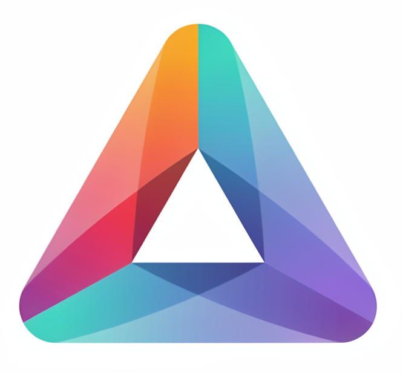

# 🛍️ PrismaOfertas

<p align="center">
  
</p>

<p align="center">

Uma plataforma moderna de **E-commerce Inteligente**, desenvolvida utilizando tecnologias de última geração do ecossistema JavaScript, priorizando **performance**, **escalabilidade**, **segurança** e **experiência do usuário**.

</p>

---

# 📖 Sobre o Projeto

O **PrismaOfertas** é uma aplicação Full Stack criada para servir como base profissional para lojas virtuais modernas.

O sistema foi desenvolvido utilizando uma arquitetura modular, escalável e de fácil manutenção, permitindo o gerenciamento completo de produtos, categorias, autenticação de usuários, armazenamento de imagens em nuvem, monitoramento de preços, automações e painel administrativo.

A proposta do projeto é unir as melhores ferramentas do mercado em uma única plataforma, proporcionando uma experiência rápida, segura e intuitiva tanto para clientes quanto para administradores.

---

# 🚀 Principais Recursos

- 🛒 Catálogo completo de produtos
- 🔎 Pesquisa dinâmica
- ❤️ Sistema de favoritos
- 📂 Gerenciamento de categorias
- 👤 Autenticação segura
- 🔐 Controle de acesso
- 🛠 Painel administrativo
- 📷 Upload de imagens
- ☁️ Armazenamento em nuvem
- ⚡ Background Jobs
- 📱 Interface Responsiva
- 🚀 Alto desempenho
- 🔒 Segurança

---

# 🏗️ Arquitetura

O projeto segue uma arquitetura Full Stack moderna baseada em componentes independentes.

```

Cliente
│
▼
Next.js + JavaScript
│
▼
Node.js
│
▼
Prisma ORM
│
▼
Neon PostgreSQL

```

Serviços externos:

- Clerk
- AWS S3
- ImageKit
- Inngest

Toda a arquitetura foi planejada visando:

- Escalabilidade
- Organização
- Modularização
- Facilidade de manutenção
- Código limpo
- Alto desempenho

---

# 💻 Stack Tecnológica

## Frontend

- JavaScript (ES6+)
- Tailwind CSS

---

## Backend

- Node.js

Responsável por:

- APIs
- Regras de negócio
- Comunicação com banco de dados
- Processamento assíncrono
- Integração entre serviços

---

## Banco de Dados

### Prisma ORM

O Prisma atua como camada de acesso ao banco de dados oferecendo:

- ORM moderno
- Relacionamentos
- Migrations
- Consultas otimizadas
- Segurança
- Facilidade de manutenção

---

### Neon PostgreSQL

Banco de dados Serverless baseado em PostgreSQL.

Armazena:

- Produtos
- Categorias
- Usuários
- Favoritos
- Configurações
- Dados administrativos

---

## Autenticação

### Clerk

Todo o gerenciamento de usuários é realizado utilizando Clerk.

Recursos:

- Cadastro
- Login
- Logout
- Sessões
- Middleware
- Rotas protegidas
- Controle de permissões

---

## Upload de Arquivos

### AWS S3

Utilizado para armazenamento seguro de arquivos.

Benefícios:

- Alta disponibilidade
- Escalabilidade
- Segurança
- Excelente desempenho

---

## Gerenciamento de Imagens

### ImageKit

Responsável pela otimização automática das imagens.

Funcionalidades:

- Compressão
- CDN
- Redimensionamento
- Conversão automática
- Melhor carregamento

---

## Automações

### Inngest

Executa tarefas em segundo plano.

Exemplos:

- Atualização automática de preços
- Monitoramento periódico
- Processamento de filas
- Jobs agendados
- Execuções assíncronas

---

# ⚙️ Funcionalidades

## 🛒 Produtos

- Cadastro
- Atualização
- Exclusão
- Pesquisa
- Paginação
- Imagens
- Descrições
- Preços
- Promoções

---

## 📂 Categorias

Organização inteligente dos produtos.

---

## 🔎 Pesquisa

Sistema de busca rápida para localização de produtos.

---

## ❤️ Favoritos

Usuários autenticados podem salvar produtos favoritos.

---

## 👤 Usuários

Gerenciamento completo através do Clerk.

---

## 🛠 Administração

Painel exclusivo para administradores.

Permite:

- Gerenciar produtos
- Atualizar preços
- Gerenciar categorias
- Administração geral

---

## 📱 Responsividade

Interface desenvolvida utilizando conceito **Mobile First**, funcionando perfeitamente em:

- Desktop
- Notebook
- Tablet
- Smartphone

---

# 🚀 Performance

Diversas técnicas foram aplicadas para otimizar a aplicação.

Entre elas:

- Lazy Loading
- Compressão de imagens
- CDN
- Consultas otimizadas
- Componentização
- Código modular
- Background Jobs
- Processamento assíncrono

---

# 🔒 Segurança

O sistema utiliza boas práticas modernas de desenvolvimento.

Incluindo:

- Autenticação segura
- Rotas protegidas
- Middleware
- Validação de dados
- Controle de acesso
- Sessões seguras

---

# 📦 Estrutura do Projeto

```

app/
components/
lib/
actions/
hooks/
prisma/
public/
styles/

````

Organizado seguindo boas práticas para facilitar manutenção e escalabilidade.

---

# ⚡ Instalação

Clone o projeto

```bash
git clone https://github.com/LenonGabrielNogueira/PrismaOfertas.git
````

Entre na pasta

```bash
cd PrismaOfertas
```

Instale as dependências

```bash
npm install
```

Configure o arquivo

```
.env
```

Execute as migrations

```bash
npx prisma migrate dev
```

Inicie o projeto

```bash
npm run dev
```

---

# 📌 Tecnologias

* Node.js
* JavaScript
* Prisma ORM
* Neon PostgreSQL
* Tailwind CSS
* Clerk
* AWS S3
* ImageKit
* Inngest

---

# 🎯 Objetivos

Este projeto foi desenvolvido visando:

* Arquitetura profissional
* Escalabilidade
* Segurança
* Alto desempenho
* Código limpo
* Organização
* Facilidade de manutenção
* Experiência do usuário

Além de servir como um projeto de portfólio demonstrando conhecimentos em desenvolvimento Full Stack moderno.

---

# 📈 Futuras Implementações

* Sistema de avaliações
* Histórico de preços
* Dashboard analítico
* Lista de desejos
* Comparador de produtos
* Integração com APIs externas
* Sistema de cupons
* Pagamentos online
* Marketplace
* Inteligência Artificial para recomendações

---

# 👨‍💻 Autor

**Lenon Gabriel Nogueira**

Desenvolvedor Full Stack apaixonado por tecnologia, automação e desenvolvimento de aplicações modernas utilizando o ecossistema JavaScript.

---

# ⭐ PrismaOfertas

Se este projeto foi útil para você, considere deixar uma **⭐ no repositório**.

```
```
